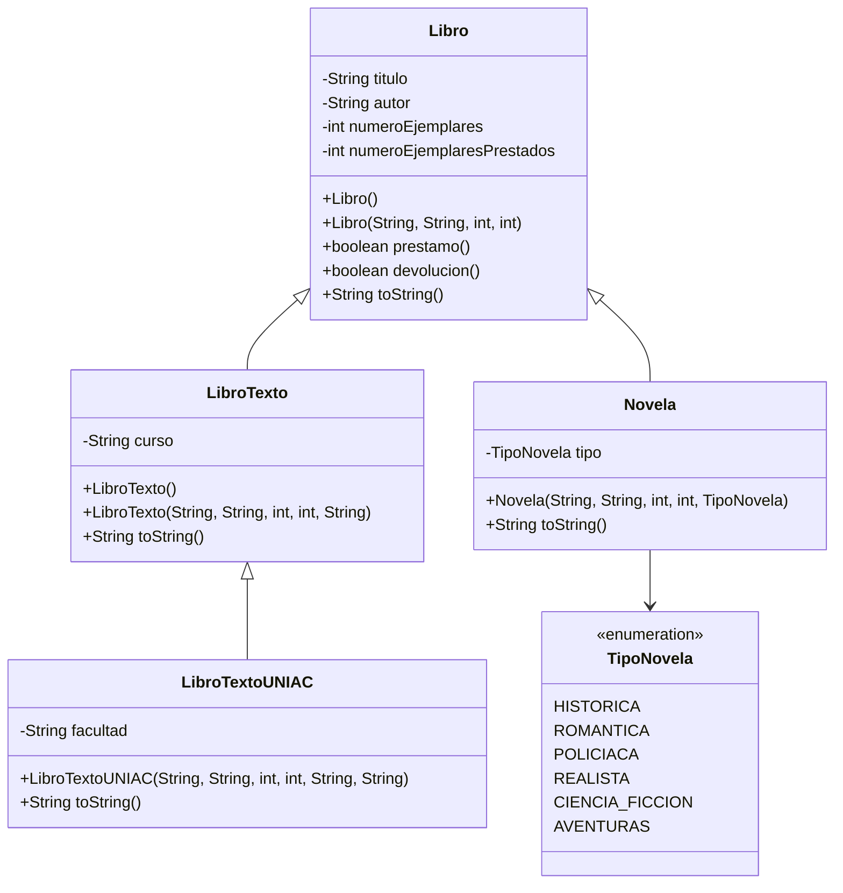

# Nombre de los estudiantes

*Santiago Alonso Perafan
*Daniel Rubio Marmolejo


# Sistema de gestion de biblioteca

Proyecto Maven para el Parcial I de Programacion II. Requiere Java 17.

## Ejecucion

Desde esta carpeta:

```text
mvn test
java -cp target/classes com.biblioteca.Main
```

`Main` solicita por consola los datos de `libro2` y crea los otros tres objetos
con valores de ejemplo.

## Algoritmo

1. Crear `libro1` usando el constructor con parametros.
2. Crear `libro2` usando el constructor vacio.
3. Leer por consola titulo, autor, total de ejemplares y ejemplares prestados,
   y asignarlos mediante sus metodos `set`.
4. Crear un `LibroTextoUNIAC` con los atributos heredados, el curso y la
   facultad.
5. Crear una `Novela` indicando un valor de `TipoNovela`.
6. Mostrar los cuatro objetos usando el polimorfismo de `toString`.
7. Para un prestamo, comprobar si los ejemplares prestados son menores que el
   total. Si hay disponibilidad, incrementar el contador y devolver `true`;
   de lo contrario devolver `false`.
8. Para una devolucion, comprobar que exista al menos un ejemplar prestado. Si
   existe, disminuir el contador y devolver `true`; de lo contrario devolver
   `false`.

## UML



## Dos situaciones en las que no se podria realizar la herencia

Estos fragmentos son intencionalmente invalidos y se incluyen como analisis;
no deben descomentarse porque impedirian compilar el proyecto.

```java
public final class LibroSoloLectura { }

// Falla: una clase final no puede tener subclases.
class LibroDerivado extends LibroSoloLectura { }
```

```java
class LibroConConstructorPrivado {
    private LibroConConstructorPrivado() { }
}

// Falla: la subclase no puede invocar el constructor privado de la superclase.
class LibroDerivadoSinConstructorAccesible extends LibroConConstructorPrivado { }
```

En el proyecto real los atributos son `private`, pero la herencia sigue siendo
posible porque las subclases acceden a ellos mediante metodos `get` y `set`.

## Posibles ampliaciones

- `isbn`: identificador unico del libro.
- `fechaPublicacion`: permite conocer la antiguedad del libro.
- Metodo adicional `estaDisponible()`: devuelve `true` cuando quedan
  ejemplares para prestar.